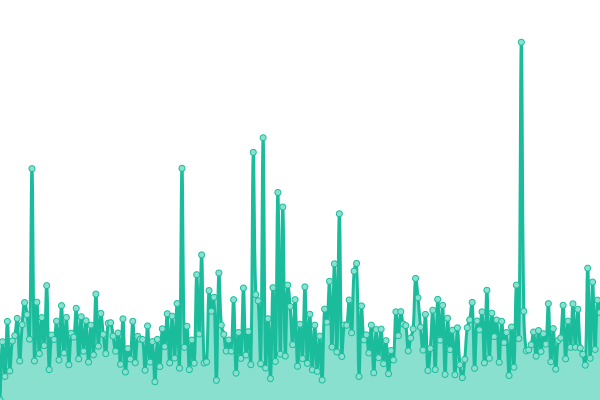
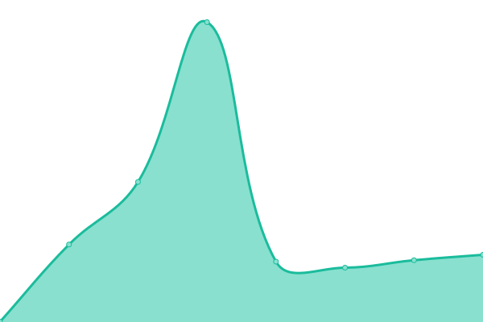

# [📈 Live Status](https://prokerala.github.io/uptime): <!--live status--> **🟧 Partial outage**

This repository contains the open-source uptime monitor and status page for [Prokerala.com](https://www.prokerala.com/), powered by [Upptime](https://github.com/upptime/upptime).

With [Upptime](https://upptime.js.org), you can get your own unlimited and free uptime monitor and status page, powered entirely by a GitHub repository. We use [Issues](https://github.com/prokerala/uptime/issues) as incident reports, [Actions](https://github.com/prokerala/uptime/actions) as uptime monitors, and [Pages](https://prokerala.github.io/uptime) for the status page.

<!--start: status pages-->
<!-- This summary is generated by Upptime (https://github.com/upptime/upptime) -->
<!-- Do not edit this manually, your changes will be overwritten -->
<!-- prettier-ignore -->
| URL | Status | History | Response Time | Uptime |
| --- | ------ | ------- | ------------- | ------ |
|  [Prokerala](https://www.prokerala.com) | 🟥 Down | [prokerala.yml](https://github.com/prokerala/uptime/commits/HEAD/history/prokerala.yml) | 

 484ms
     
 | 

<a href="https://prokerala.github.io/uptime/history/prokerala">53.71%</a>
    

|  [Prokerala API](https://api.prokerala.com) | 🟩 Up | [prokerala-api.yml](https://github.com/prokerala/uptime/commits/HEAD/history/prokerala-api.yml) | 

 358ms
     
 | 

<a href="https://prokerala.github.io/uptime/history/prokerala-api">100.00%</a>
    

<!--end: status pages-->

[**Visit our status website →**](https://prokerala.github.io/uptime)

## 📄 License

- Code: [MIT](./LICENSE) © [Prokerala.com](https://www.prokerala.com/)
- Data in the `./history` directory: [Open Database License](https://opendatacommons.org/licenses/odbl/1-0/)
